<div align="center">
  
</div>

<div align="center">

[](https://www.linkedin.com/in/vaishnavichaughule)
[](mailto:vaishnavi10chaughule@gmail.com)
[](https://github.com/vaishnavi1064)

</div>


### `✦ mission log`

```yaml
role: Software Engineer & AI/ML Systems Builder
location: Seattle, WA (Open to Relocate)
education: M.S. Computer Science @ Northeastern (Khoury College)
focus: Full-Stack Systems, Agentic AI, Multi-Agent Orchestration, RAG Pipelines, MCP Integration
research: Active — Generative AI
status: Open to Summer / Fall 2026 internships
```


### `✦ orbital stack`

<table>
<tr>
<td>☀️ <b>AI/ML Core</b></td>
<td>


</td>
</tr>
<tr>
<td>🪐 <b>Languages & Backend</b></td>
<td>


</td>
</tr>
<tr>
<td>🌌 <b>Infrastructure</b></td>
<td>


</td>
</tr>
</table>


### `✦ star systems` — projects

<table>
<tr>
<td width="50%">

🪐 **[PersonaCR](https://github.com/vaishnavi1064/PersonaCR)** — Multi-Agent Code Review
<br>`FastAPI` `React` `TypeScript` `Groq` `Jina` `ChromaDB` `MCP`

6-agent system that learns your **coding fingerprint** and reviews code against your own patterns not generic rules. Research-grounded in 9 papers (EMNLP, NAACL, ACL). Parallel agent execution (~48% latency savings), CRScore-inspired ML quality gate (~69ms validation). Exposes full pipeline via **MCP server** (SSE transport) for direct Cursor/VS Code integration. **~8.5s end-to-end.**

</td>
<td width="50%">

🌍 **[Third-Place-Finder](https://github.com/vaishnavi1064/Third-Place-Finder-Web)** — AI Recommendation Engine
<br>`React` `TypeScript` `Node.js` `Groq` `Leaflet` · [Live Demo](https://third-place-finder-web.vercel.app/)

Multi-stage RAG pipeline mapping natural language to structured categories, ranking top 10 with LLM rationale. Fault-tolerant integration with exponential backoff and anti-hallucination prompting. Deployed on Vercel + Render + Aiven.

</td>
</tr>
<tr>
<td width="50%">

🌕 **[OULAD Analytics Engine](https://github.com/vaishnavi1064/OULAD-Concurrent-Data-Analytics-Engine)** — Concurrent Data Pipeline
<br>`Java` `Multithreading` `BlockingQueue` `JUnit 5`

Processes **10.6M rows at 2.1M rows/sec** using producer-consumer architecture. 94% instruction coverage, 88% branch coverage with 51 tests including race condition harnesses. 3-person team.

</td>
<td width="50%">

☄️ **[Forest Fire Prediction](https://github.com/vaishnavi1064/Forest-Fire-prediction)** — ML Risk Prediction
<br>`Python` `Scikit-learn` `Django`

Wildfire prediction using 36K+ satellite records. R² improved 0.65→0.68 via RandomizedSearchCV. Model compressed from 700MB→93MB. Deployed via Django for real-time inference.

</td>
</tr>
</table>


### `✦ flight log` — experience

| Role | Station | Mission |
|------|---------|---------|
| **AI/ML Intern** | IBM SkillsBuild | Built supervised ML models for healthcare risk prediction + IBM Cognos dashboards |
| **Android Dev Intern** | Google for Developers | Kotlin + MVVM apps with SQLite, REST APIs, unit & UI testing |


### `✦ command crew` — leadership

**Program Manager** — GameCube Club, Northeastern · **Cloud Computing Lead** — Google Developer Groups · **Event Co-Lead** — GDSC


### `✦ signal map`

<div align="center">


</div>

<div align="center">
  
</div>
