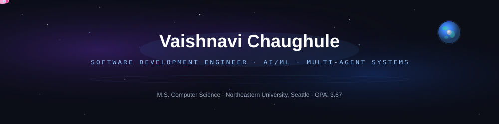

<div align="center">
  
</div>

<div align="center">

[](https://www.linkedin.com/in/vaishnavichaughule)
[](mailto:vaishnavi10chaughule@gmail.com)
[](https://github.com/vaishnavi1064)

</div>


### `✦ mission log`

```yaml
role: Software Engineer · AI/ML & Streaming Systems Builder
location: Seattle, WA (Open to Relocate)
education: M.S. Computer Science @ Northeastern (Khoury College)
focus: Real-Time Streaming, Exactly-Once Systems, Agentic AI, RAG Pipelines, MCP Integration
research: Agentic Bitcoin AML monitoring · NeurIPS 2026 JUDGe workshop (submitted)
status: Open to 2026-2027 SWE / AI-ML / Data-Platform roles (co-op + full-time)
```


### `✦ orbital stack`

<table>
<tr>
<td>☀️ <b>AI/ML Core</b></td>
<td>


</td>
</tr>
<tr>
<td>🪐 <b>Languages & Backend</b></td>
<td>


</td>
</tr>
<tr>
<td>🌠 <b>Streaming & Data</b></td>
<td>


</td>
</tr>
<tr>
<td>🌌 <b>Infrastructure</b></td>
<td>


</td>
</tr>
</table>


### `✦ star systems` — projects

<table>
<tr>
<td width="50%">

🛰️ **[Vigil](https://github.com/vaishnavi1064/vigil-streaming-anomaly-platform)** · Real-Time Streaming Anomaly Platform
<br>`Kafka` `Flink` `QLoRA` `Qwen2.5-7B` `ClickHouse` `Iceberg` `PyTorch`

Production-shaped streaming platform with **provable exactly-once processing** (Kafka + Flink), crash-tested via TaskManager SIGKILL with **zero duplicates on recovery** and **zero reconciliation drift over 5.7M readings / 4 hours**. Pairs a zero-shot foundation-model detector with a **QLoRA-fine-tuned Qwen2.5-7B planner (97.7% exact-match on held-out hard cases vs 20% rules baseline)** behind a deterministic safety gate. **76,556 events/sec**, p99 detection **0.493 ms**, **697 tests**, CI-gated.

</td>
<td width="50%">

🪐 **[PersonaCR](https://github.com/vaishnavi1064/PersonaCR)** · Multi-Agent Code Review
<br>`FastAPI` `React` `TypeScript` `Groq` `Jina` `ChromaDB` `MCP`

6-agent system that learns your **coding fingerprint** and reviews code against your own patterns, not generic rules. Research-grounded in 9 papers (EMNLP, NAACL, ACL). Parallel agent execution (~48% latency savings), CRScore-inspired ML quality gate (~69ms validation). Exposes the full pipeline via an **MCP server** (SSE transport) for direct Cursor / VS Code integration. **~8.5s end-to-end.**

</td>
</tr>
<tr>
<td width="50%">

📡 **[Streaming Density Monitor](https://github.com/vaishnavi1064/sliding-window-kde-monitor)** · Sublinear KDE Sketch (C++17)
<br>`C++17` `pybind11` `Kafka` `Prometheus` `Grafana` `MCP`

Re-implemented a 2025 sliding-window Approximate-KDE sketch (RACE + exponential histograms) as a tested package, **catching and fixing 7 defects (2 in the paper's own pseudocode)**, each pinned by a regression test. Grew the suite to **130 tests** validated against brute-force ground truth. Ported the hot path to **C++17 behind pybind11 for ~10-20x faster updates**, taking a 1.5M-reading pass from **23.9 min to 1.1 min**, held bit-for-bit identical to the Python oracle.

</td>
<td width="50%">

🧠 **[Dory.md](https://github.com/vaishnavi1064)** · Memory-Aware Notes (RAG + Spaced Repetition)
<br>`React` `TypeScript` `FastAPI` `ChromaDB` `RAG` `FSRS-4`

Full-stack notes app that scores **how fast you're forgetting each note** (Ebbinghaus forgetting curve) and uses that decay signal to re-rank semantic search, schedule FSRS-4 reviews, and generate quizzes from your weakest material. FastAPI + dual SQLite/ChromaDB store with MiniLM embeddings, **43 API routes**, an 11-page React SPA (**8,170 lines TS/TSX**), **92 tests**, JWT auth with rotation, per-user isolation, and GDPR export.

</td>
</tr>
<tr>
<td width="50%">

⚙️ **[OULAD Analytics Engine](https://github.com/vaishnavi1064/OULAD-Concurrent-Data-Analytics-Engine)** · Distributed Data Pipeline (gRPC)
<br>`Java` `gRPC` `Multithreading` `JUnit 5`

Processes a **10.65M-row / 433 MB** dataset three ways (sequential, single-node concurrent, and a **gRPC distributed system**), each proven to produce the **same SHA-256 checksum**. Byte-range shard planner, **worker- and coordinator-failure recovery** with exactly-once re-queueing, and a PySpark equivalence check. **122 tests**, 84% instruction / 76% branch coverage, plus a chaos harness that force-kills workers mid-run.

</td>
<td width="50%">

🌍 **[Third-Place-Finder](https://github.com/vaishnavi1064/Third-Place-Finder-Web)** · AI Recommendation Engine
<br>`React` `TypeScript` `Node.js` `Groq` `Leaflet` · [Live Demo](https://third-place-finder-web.vercel.app/)

Multi-stage RAG pipeline mapping natural language to structured categories, ranking the top 10 with LLM rationale. Fault-tolerant integration with exponential backoff and anti-hallucination prompting. Deployed on Vercel + Render + Aiven.

</td>
</tr>
</table>

**More:** ☄️ **[Forest Fire Prediction](https://github.com/vaishnavi1064/Forest-Fire-prediction)** · wildfire risk model on 36K+ satellite records, R² 0.65 → 0.68 via RandomizedSearchCV, model compressed 700MB → 93MB, served through Django.


### `✦ deep space` — research & publications

**Agentic Bitcoin Transaction Monitoring** · InsightX Lab, Northeastern (Prof. Divya Chaudhary)

Co-authored *"Who Makes the Decision? Evaluator Validity in an Agentic Bitcoin Transaction-Monitoring Pipeline,"* submitted to the **NeurIPS 2026 JUDGe workshop**. Built a Bitcoin illicit-transaction detector from scratch using a **Bi-EvolveGCN-O** temporal graph encoder (5-seed ensemble, per-timestep recalibration): **F1 0.5644 / AUC 0.8665** on Elliptic++ (**203K transactions, 822K wallets, 49 timesteps**), reported honestly against a Random Forest baseline that beats it. Added a **multi-agent RAG compliance layer** that retrieves FATF / FinCEN / OFAC clauses and an entailment gate that verifies retrieved regulation before a case report is finalized.


### `✦ flight log` — experience

| Role | Station | Mission |
|------|---------|---------|
| **AI/ML Intern** | IBM SkillsBuild | Built supervised ML models for healthcare risk prediction + IBM Cognos dashboards |
| **Android Dev Intern** | Google for Developers | Kotlin + MVVM apps with SQLite, REST APIs, unit & UI testing |


### `✦ command crew` — leadership

**Program Manager** · GameCube Club, Northeastern &nbsp;·&nbsp; **Cloud Computing Lead** · Google Developer Groups &nbsp;·&nbsp; **Event Co-Lead** · GDSC


### `✦ signal map`


<div align="center">
  
</div>
